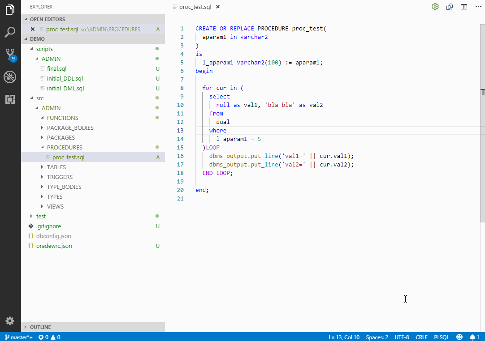

# Oradew

[](https://dev.azure.com/mickeypearce0384/Oradew/_build/latest?definitionId=1)

**PL/SQL development with Git and a simple compile-package-deploy workflow**

This extension allows you to develop your PL/SQL project in Visual Studio Code. It enables you to:

- Manage PL/SQL source code with version control (Git)
- Compile files and Run statements<sup>New</sup> with ORA errors problem matching
- Package files into a single script and deploy to multiple environments in one click



## Workspace Structure

```
./deploy                Distribution package
./scripts               Deployment scripts (DDL, DML, etc)
./src                   Source with PL/SQL objects (FUNCTIONS, PACKAGES, PROCEDURES, TABLES, TRIGGERS, TYPES, VIEWS)
./test                  Unit tests
dbconfig.json           DB connection configuration
oradewrc.json           Workspace configuration
```

## Commands

### Basic Workflow

**Setup**

- `Initialize Workspace/Version` - Create/clean workspace structure and configuration files
- `Import All Source from DB` - Create Source files from DB objects from DEV environment

**Build**

- `Compile Changes to DB` (F6) - Compile changed Source objects (working tree) to DEV. Succesfully compiled files are added to Staging area.
- `Compile Current File` - Compile file to DEV
- `Run Current File as Script` (F5) - Run as Script on DEV environment (with SQLPlus)
- `Run Selected Statement` (Shift+Enter) - Execute a single SQL or PL/SQL statement with autoCommit and dbms_output enabled

**Install**

- `Package` (F8) - Generate distribution package script, TODOs file and ChangeLog
- `Deploy to TEST / UAT` - Run distribution package script on TEST or UAT environment (with SQLPlus)

### Additional

- `Import Changes from DB` (Shift + F6)
- `Import Current File / Import Selected Object`
- `Compile All Source to DB`
- `Run tests` (F7)
- `Populate Package Input` with changed files from Git history using latest tagged commit as a starting point. (Shift + F8)
- `Generate` PL/SQL with a code generator.

## Configuration

Workspace supports a base configuration file (`oradewrc.json`). An additional configuration file for each environment is also supported (`oradewrc.test.json`, `oradewrc.uat.json`). The base configuration contains settings that are usually common across all environments but can be extended (overloaded) optionally by environment specific configurations for environment specific commands.

Configuraton files are not required. Default values will be assumed in case they are not present. The following settings are available (`oradewrc*.json`):

```json
{
  "package.input": [
    "./scripts/**/initial*.sql",
    "./src/**/VIEWS/*.sql",
    "./src/**/TYPES/*.sql",
    "./src/**/TYPE_BODIES/*.sql",
    "./src/**/TRIGGERS/*.sql",
    "./src/**/PACKAGES/*.sql",
    "./src/**/PACKAGE_BODIES/*.sql",
    "./src/**/FUNCTIONS/*.sql",
    "./src/**/PROCEDURES/*.sql",
    "./scripts/**/final*.sql",
    "!./**/*EXCLUDE*.sql"
  ],
  "package.output": "./deploy/Run.sql",
  "package.encoding": "utf8",
  "package.templating": false,
  "source": ["./src/**/*.sql"],
  "compile.warnings": "NONE",
  "compile.force": false,
  "version.number": "0.0.1",
  "version.description": "New feature",
  "version.releaseDate": "2099-01-01",
  "test.input": ["./test/**/*.test.sql"],
  "import.getDdlFunction": "dbms_metadata.get_ddl",
  "generator.define": []
}
```

- `package.input` - Array of globs for packaging files into deploy script file (output). Preserving order, prefix with ! for excluding. Use `Populate Package Input` to extract only changed file paths from Git history starting from latest tagged commit (latest version). This way you can package and deploy only current version changes.
- `package.output` - Deploy script file path. Created with `Package` command from concatenated input files and prepared for SQLPlus execution. (wrapped with "SPOOL deploy.log", "COMMIT;", etc )
- `package.encoding` - Encoding of deploy script file. (ex.: utf8, win1250, ...) The default value is `utf8`.
- `package.templating` - Turn on templating of config variables. Use existing ('${config[\"version.releaseDate\"]}') or declare a new variable in config file and than use it in your sql file. Variables are replaced with actual values during packaging (`Package` command). The default value is `false`.
- `source` - Glob pattern for source files.
- `compile.warnings` - PL/SQL compilation warning scopes. The default value is `NONE`.
- `compile.force` - Conflict detection (on DEV environment). If object you are compiling has changed on DB (has a different DDL timestamp), you are prevented from overriding the changes with a merge step. Resolve merge conflicts if necessary and than compile again. Set to `true` to compile without conflict detection. The default value is `false`.
- `version.number` - Version number.
- `version.description` - Version description.
- `version.releaseDate` - Version release date.
- `test.input` - Array of globs for test files.
- `import.getDdlFunction` - Custom Get_DDL function name. Use your own DB function to customize import of object's DDL. It is used by `Import` commands. The default value is `DBMS_METADATA.GET_DDL`.
  ```sql
  -- Example of a DB function specification:
  FUNCTION CustomGetDDL(object_type IN VARCHAR2, name IN VARCHAR2, schema IN VARCHAR2 DEFAULT NULL) RETURN CLOB;
  ```

### Code Generator

Configure the setting `generator.define` to define code generators. Then use `Generate` command to generate your PL/SQL code.

The `label` and `function` properties are required for a generator to be succesfully defined but a `description` is optional. You can also use `output` property to define a file path of the generated content (also optional). If the `output` is omitted a file with unique filename is created in `./scripts` directory. A generator example follows:

```json
  "generator.define": [
    {
      "label": "Update Statement",
      "function": "utl_generate.updateStatement",
      "description": "Generate update statement for a table"
    }
  ]
```

The DB `function` must have the following DB signature:

```sql
-- Example of a DB function specification:
FUNCTION updateStatement(
  object_type IN VARCHAR2,    -- derived from path of ${file}
  name IN VARCHAR2,           -- derived from path of ${file}
  schema IN VARCHAR2,         -- derived from path of ${file}
  selected_object IN VARCHAR2 -- ${selectedText}
) RETURN CLOB;
```

The first three function parameters (`object_type`, `name`, `schema`) are derived from path of the currently opened file, whereas `selected_object` is the currently selected text.

See DB function from this example: [utl_generate.sql](plsql-generators/utl_generate.sql) and please submit your own!

## Important

### Prerequisites

- Node.js
- Git
- SQLPlus

> `Oracle driver (node-oracledb) in extension is precompiled with "node-v59 (Node.js 9) - win32 - x64 (64bit)" binary package.`

Oracle client library architecture (instantclient), Node.js version, OS and architecture must match precompiled configuration otherwise node-oracledb drivers have to be rebuild.

```bash
## Rebuild Oracle drivers (in ext folder ~/.vscode/extensions/mp.oradew-vscode-...):
> npm rebuild
```

### Included extensions:

- Language PL/SQL
- oracle-format

### Recommended extensions:

- GitLens
- Numbered bookmarks
- Better comments
- Multiple clipboards
